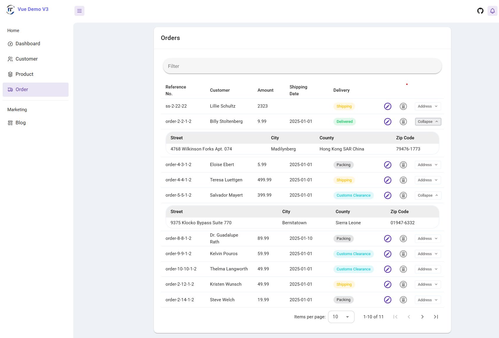
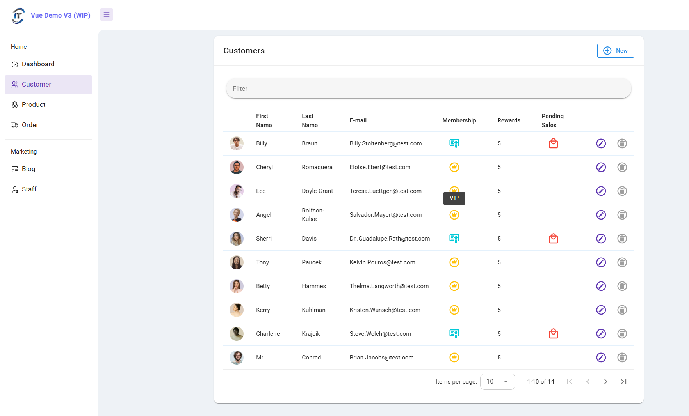
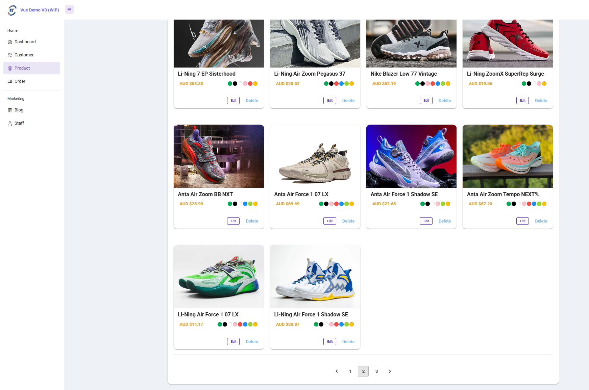
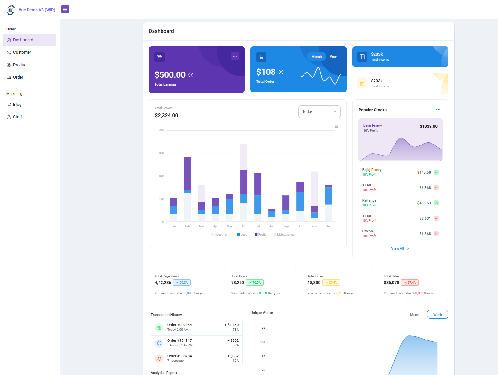
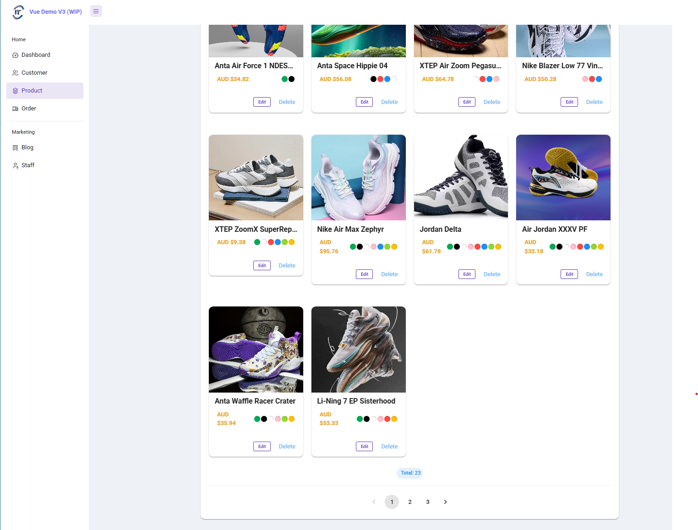
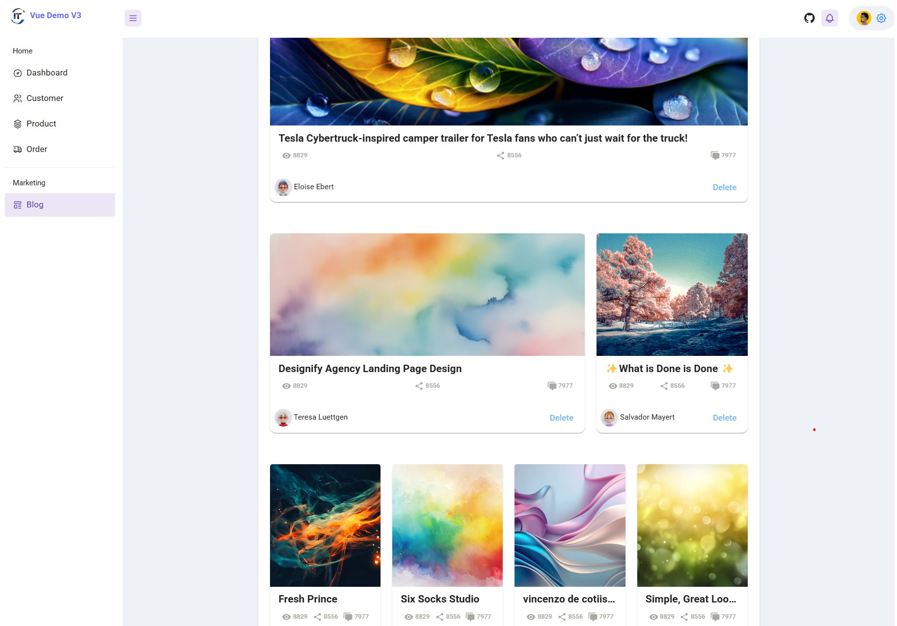

11# Vue Demo App V3

> A reusable Vue.js starter project for real-world business based on Vue 3 with Vuetify 3 and Pinia.

The goal of this project is to build a reusable starter project for real-world business. To achieve this target, we need a solution which includes state management (Pinia), fake restful API and elegant UI design (Vuetify).

### Screenshots

#### Latest Version

<!--  -->
<!--  -->

<!--  -->



## Build Setup

``` bash

# Clone project
git clone https://github.com/harryho/vue-crm.git


# install dependences for Vue 2 CRM
cd vue-crm
npm install 


# serve with hot reload at localhost:8080
npm run dev


```

## Docker 


```bash
## Run / Test release without building new image
npm run build

# Launch nginx image to test latest release
docker pull nginx:alpine
docker run -p 8080:80 -v \
    <your_aboslute_path>/dist:/usr/share/nginx/html nginx:alpine


# Build release image
docker build . -t  vue-demo:3.0

# Launch the development image in the backgroud
docker run --rm -d --publish 8080:80  --name vd3 vue-demo:3.0

# Check the log
docker logs vd3   -f

```


For detailed explanation on how things work, checkout following links

* [vue](https://vuex.vuejs.org/en/)
* [vuetifyjs](https://dev.vuetifyjs.com/)
* [Pinia](https://pinia.vuejs.org/)


